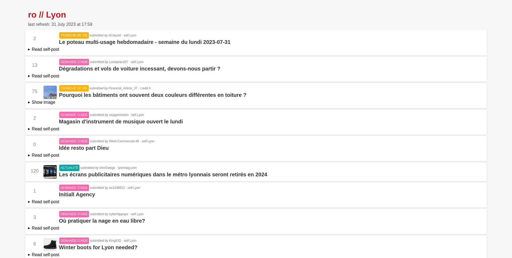

# RedOnly
[](https://github.com/cnovel/redonly/actions/workflows/python-test.yml)
[](https://codecov.io/gh/cnovel/redonly)


`redonly` is a Python package used for creating a static archive of Reddit subs at present time.

The goal of *RedOnly* is to prevent doomscrolling and comment-reading only on Reddit.



## How to use
Here's a minimal example for using RedOnly:
```python
import redonly.redonly as ro


ronly = ro.RedOnly("output_folder", ["france", "europe", "ProgrammerHumor"])
if not ronly.generate():
    print("Failed to generate!")
else:
    print("Success")
```
